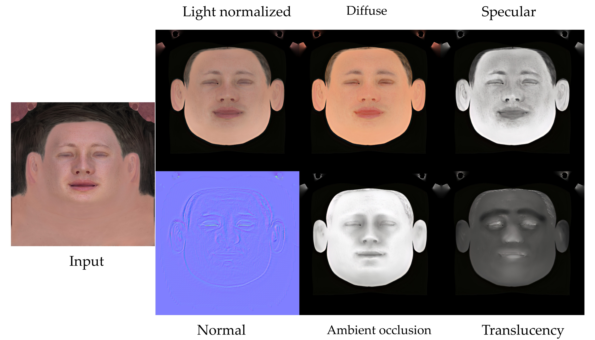

© [2023] Ubisoft Entertainment. All Rights Reserved
## FFHQ-UV-Intrinsics dataset
This GitHub repository hosts the **FFHQ-UV-Intrinsic** dataset, that contains intrinsics texture maps for 10K subjects. This dataset was obtained by applying [MoSAR](https://ubisoft-laforge.github.io/character/mosar/) on the [FFHQ-UV](https://github.com/csbhr/FFHQ-UV) dataset.

To obtain the intrinsic face attributes, we first re-targeted the texture maps from FFHQ-UV to our own topology and resized them to 512x512. Next, we applied MoSAR to obtain the light normalization and intrinsic texture maps. We then upscaled these texture maps to 1K resolution and retargeted them back to their original topology.
The resulting dataset, **FFHQ-UV-Intrinsics**, is being publicly released for the research community under Creative Commons Attribution-NonCommercial-NoDerivatives license. 

**The dataset contains diffuse, specular, ambient occlusion, translucency and normal maps for 10K subjects**.

This is the first dataset that offer rich intrinsic face attributes at high resolution and at large scale, with the aim of advancing research in this field.

<p align="center">

   <p align="center">
  <em>Figure 1. For each input texture from FFHQ-UV (first column), we provide the light normalized, diffuse, specular, normal, ambient occlusion and translucency maps at 1K resolution for 10K subjects</em>
      </p>
</p>

## Download
The dataset is stored in this repo with [Git LFS](https://git-lfs.com/). 

To download the dataset, simply clone this repo (make sure you have Git LFS installed). Please note that cloning may take a significant amount of time depending on your internet connection speed.

Once you extract the zip files, you'll find the dataset structured as follows:
```
Data\
    <##ID>\
          ambient_occlusion.png
          diffuse.png
          normal.png
          specular.png
          translucency.png
          light_normalized.png
    ....
    
```

The IDs on this dataset are the same as the IDs in [FFHQ-UV](https://github.com/csbhr/FFHQ-UV).

Refer to the [paper](https://arxiv.org/abs/2312.13091) for more technical details on these maps.

## Using these textures with the [FLAME](https://flame.is.tue.mpg.de/) topology
The current texture maps are registred in the Hifi3D topology (https://github.com/czh-98/REALY/tree/master/HIFI3D%2B%2B). If you want to use these textures with Flame model. Please refer to this tutorial:  https://github.com/csbhr/FFHQ-UV/blob/main/README_flame2hifi3d.md

## Blender scene
We will provide a blender scene to render these textures.

## Cite
This dataset was built using the MoSAR model. If you use this datase please cite the following work: 

```
@article{dib2024mosar,
  author    = {Dib, Abdallah and Hafemann, Luiz G. and Got, Emeline and Anderson, Trevor and Fadaeinejad, Amin and Cruz, Rafael M.O and Carbonneau, Marc-André},
  title     = {MoSAR: Monocular Semi-Supervised Model For Avatar Reconstruction Using Differentiable Shading},
  journal   = {arXiv preprint arXiv:2312.13091},
  year      = {2024},
}
```

## License 

**FFHQ-UV-Intrinsics** can only be used for research purpose. Please refer to the license.txt file for more details. 

© [2023] Ubisoft Entertainment. All Rights Reserved

